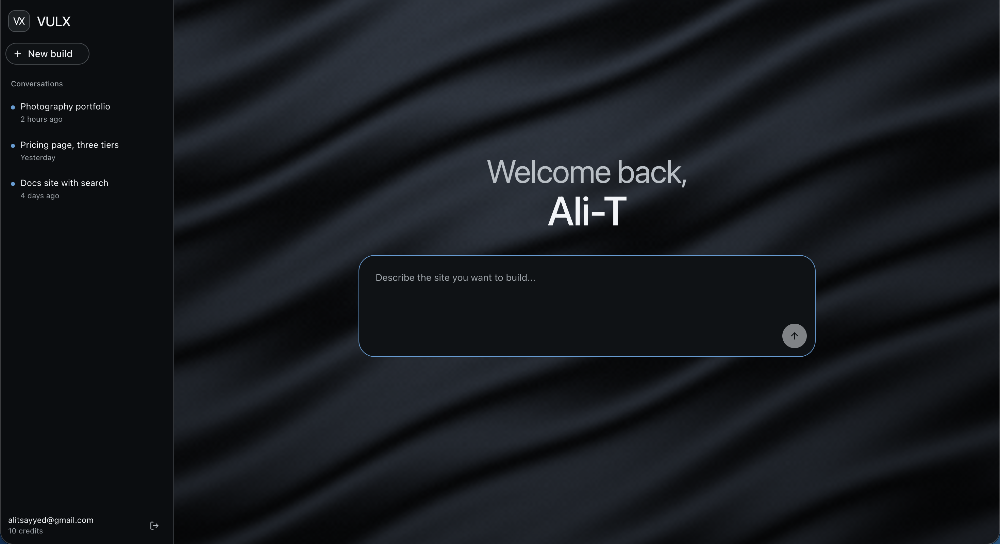

# VULX

A SaaS that turns natural language into working frontend code, with a live preview running in a sandboxed environment — similar to Bolt or Lovable.



## Tech Stack

- **Backend:** Go (hexagonal/DDD) · FastAPI (Python, LangChain + E2B sandboxes) · PostgreSQL · Redis · Temporal
- **Contracts:** Protocol Buffers via Buf · Connect RPC + Vanguard (dual gRPC/REST)
- **Frontend:** Next.js · Shadcn UI · React Query
- **Infra:** Docker Compose · Caddy (HTTPS reverse proxy) · E2B

See [ARCHITECTURE.md](./ARCHITECTURE.md) for design rationale and the full OAuth/JWT flow.

## Running the App

Requires: Git, Go ^1.24.2, Docker + Docker Compose, Make, Node ^18.x, Python ^3.11, Buf CLI.

```bash
git clone <repository-url>
cd <project-directory>
```

Create env files (secrets live outside this repo):

- `../AI-Website-Builder-Secrets/.api-env` and `.ai-service-env` — required keys in `api/.env.example` / `ai-service/.env.example`, plus:
  ```
  APP_URL=https://local.app.vulx.ai
  API_URL=https://local.api.vulx.ai
  REDIRECT_URL=https://local.app.vulx.ai/auth/callback
  ```
- `app/.env.local`:
  ```
  NEXT_PUBLIC_API_URL=https://local.api.vulx.ai
  ```

Add to `/etc/hosts`:
```
127.0.0.1 local.api.vulx.ai
127.0.0.1 local.app.vulx.ai
```

Register `https://local.app.vulx.ai/auth/callback` as an authorized redirect URI in Google Cloud Console.

```bash
make gen     # generate protobufs
make         # start all services
make trust   # trust Caddy's local CA (run again after make nuke)
```

- **Frontend:** https://local.app.vulx.ai
- **API:** https://local.api.vulx.ai
- **Temporal UI:** http://localhost:8081
